<picture>
  <source
    media="(max-width: 600px) and (prefers-color-scheme: light)"
    srcset="./hero-banner-light-mobile.svg"
  />
  <source
    media="(max-width: 600px)"
    srcset="./hero-banner-mobile.svg"
  />
  <source
    media="(prefers-color-scheme: light)"
    srcset="./hero-banner-light.svg"
  />
  
</picture>

---

## About

Computer Science Student, 21M. 
Playing with coding since 2017, starting out by modding games before moving into real software and low-level engineering. Years spent digging through Linux and Android internals shaped how I approach problems — I'd rather take a working system apart than build one from scratch.

---

## Background

In 2018 I started a YouTube channel centered on Free Fire hacking and modding. It grew into the most-subscribed channel in the Free Fire hacking category at the time, reaching 65K subscribers before it was terminated in 2021. That shutdown pushed me toward more serious, structured work and focus on my love for reverse engineering, malware analysis, and security research.

<b>Full timeline</b> (click to expand)

 

| Year | Milestone |
|---|---|
| 2017 | Started coding by modding games |
| 2018 | Launched a YouTube channel around Free Fire hacking |
| 2018 – 2021 | Grew it into the most-subscribed channel in the FF hacking category |
| 2021 | Channel terminated at 65K subscribers |
| 2021 – Present | Shifted focus to Android RE, malware analysis, and bug bounty work |

---

## Stack

<!-- Languages -->

  
  
  
  
  
  
  
  

<!-- Android / Modding -->

  
  
  
  
  
  
  
  
  
  

<!-- Reverse Engineering -->

  
  
  
  
  
  
  
  
  
  

<!-- Malware Analysis / Security Research -->

  
  
  
  
  
  
  

<!-- Web Scraping / Automation -->

  
  
  
  
  
  
  

<!-- Steganography / Forensics -->

  
  
  
  
  
  
  

<!-- Networking / Recon -->

  
  
  
  
  
  

<!-- Media / Binary Processing -->

  
  
  
  

<!-- DevOps / Environment -->

  
  
  
  
  
  

 

---

## GitHub Stats

<picture>
  <source
    media="(prefers-color-scheme: dark)"
    srcset="https://raw.githubusercontent.com/RevealedSoulEven/RevealedSoulEven/gh-pages/github-contribution-grid-snake-dark.svg"
  />
  <source
    media="(prefers-color-scheme: light)"
    srcset="https://raw.githubusercontent.com/RevealedSoulEven/RevealedSoulEven/gh-pages/github-contribution-grid-snake.svg"
  />
  
</picture>

---

## Contact

  
  
  

<!---
RevealedSoulEven/RevealedSoulEven is a ✨ special ✨ repository because its `README.md` (this file) appears on your GitHub profile.
You can click the Preview link to take a look at your changes.
--->
